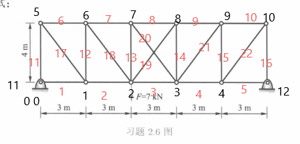

# 添加内容
## 1、在ulitls.py文件中添加罚函数刚度矩阵组装函数（penalty_assembly）和求解函数(solvedr_penalty)；
## 2、在truss.py中添加组装函数和求解函数
## 3、添加《有限元基础》中2-6的参数文件-truss_2_6.json；
## 4、2-6的单元编号和节点编号见下图

## 前处理中添加三维长度计算单元
## TrussElem函数中添加三维单元刚度计算公式
## 求解函数中添加对角元小数 ，解决三维矩阵求解二维结构时所遇到的矩阵奇异问题
## 在penalty_solvedr中添加了约束力求解公式